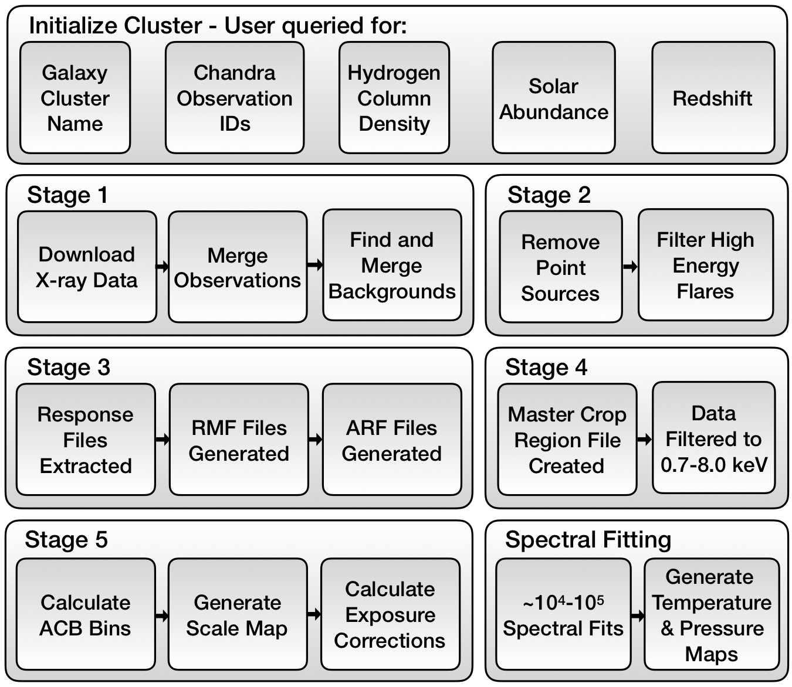

## Current beta version for CIAO 4.14
To use this version of ClusterPyXT please install CIAO-4.14 using conda as outlined by [here](http://cxc.harvard.edu/ciao/download/conda.html). This version of `ClusterPyXT` requires python 3.8 or greater, the default for CIAO 4.14. See below for further details on the `CIAO` installation. 

## Introduction
ClusterPyXT is a software pipeline to automate the creation of x-ray temeprature maps, pressure maps, surface brightness maps, and density maps. It is open source and under active development. Please feel free to contribute! See the contribution section below for more details. (Even if you're new to everything!)

## Overview

## Requirements
This version of `ClusterPyXT` requires `CIAO-4.14`. The full calibration database (CALDB) is a requirement as well and can be installed with CIAO. To do so, during step 2 of the `conda`  environment creation change `caldb_main` to `caldb`. 

### CIAO Installation
These instructions are for `CIAO 4.14`. Follow the installation instructions at the [Chandra X-ray Center (CXC)](http://cxc.harvard.edu/ciao/download/conda.html). Note, the custom installation option should be used as it allows for the full `CALDB` installation. Make sure to select all `CALDB` options before downloading the installation script. Additionally, it is recommended you install the latest version of `Python` during installation. `Python 3.8` is required at a minimum.

Another requirement for `ClusterPyXT` is the `astropy` python library within the `CIAO` environment. `CIAO 4.14` allows for the easy installation of this library. 
After installation, start the `CIAO` environment and run `conda install astropy tqdm`. 

### Download ClusterPyXT
To download ClusterPyXT, simply run `git clone https://github.com/bcalden/ClusterPyXT.git`.

## Running ClusterPyXT
### System Configuration
After following the instructions above, go the `ClusterPyXT` directory and run `python clusterpyxt.py` to initialize the system configuration. 

### Cluster Initialization
Next, you must initialize a cluster. At a minimum, you need the name for the cluster and the Chandra Observation IDs you plan on using. Names can be whatever you want (e.g. A85, A115, Bullet, Toothbrush) just recognize the name needs to be valid in directory and file names. That means don't use slashes or other characters disallowed by your filesystem. Observation IDs can be found using the [Chandra Data Archive](https://cda.harvard.edu/chaser/). While you can start the pipeline with just this information, redshift, hydrogen column density, and the metallicity of the cluster are required to complete the spectral fitting. Redshift information can be found at the [NASA/IPAC Extragalactic Database (NED)](https://ned.ipac.caltech.edu). Hydrogen column density information can be found at [NASA HEASARC Tools](https://heasarc.gsfc.nasa.gov/cgi-bin/Tools/w3nh/w3nh.pl). Solar abundance can usually be estimated at `0.3` although you can check the literature to see if a better value for your cluster should be used.

There are various ways to initialize a cluster. To use the CLI GUI(beta), just run `python clusterpyxt.py`.

### Processing a Cluster
After a cluster is initialized, you can simply start/continue the pipeline by running `python clusterpyxt.py` and selecting the continue option. The pipeline will prompt for additional input (point source region files, exclusion areas, etc.). Follow a detailed walkthrough below.

#### Stage 1
Required: Cluster initialized following the above process [Cluster Initialization](#cluster-initialization)
Main output: Merged X-ray surface brightness map.

After cluster initialization the pipeline will download, reproject, and merge the observations and backgrounds. This process can take on order of 10s of minutes to hours (for large numbers of observations).  

#### Stage 2
Required: `sources.reg` and `exclude.reg` 
Main output: X-ray surface brightness with sources removed.

At this stage, the data is downloaded and the observations are merged into a surface brightness map - `../[pipeline_data_dir]/[cluster_name]/[cluster_name]_broad_flux.img`. Now it is time to filter out point sources and high energy flares. To do so, first open the surface brightness map and create regions around sources you want excluded from the data analysis. These are typically foreground point sources one does not want to consider when analyzing the cluster. Save these regions as a DS9 region file named `../[pipeline_data_dir]/[cluster_name]/sources.reg`. 

Additionally, you need to create a region file containing any regions you wanted excluded from the deflaring process. This would include areas such as the peak of cluster emission as these regions may contain high energy events you want to consider in this analysis. Save this region file as `../[pipeline_data_dir]/[cluster_name]/exclude.reg`. 

After both files are saved, you can continue ClusterPyXT by running `python clusterpyxt.py --continue` or through the CLI GUI.

#### Stage 3
Required: `acisI_region_0.reg` file for each observation.

Main output: [RMF](http://cxc.harvard.edu/ciao/dictionary/rmf.html) and [ARF](http://cxc.harvard.edu/ciao/dictionary/arf.html) files. 

This stage extracts the RMF and ARF files. Before continuing the pipeline you need to create a region file for each observation. Each observation will need its own region file named acisI_region_0.reg and saved in the respective analysis directory (`../[pipeline_data_dir]/[cluster_name]/[observation_id]/analysis/acisI_region_0.reg`).

To create this file, select the `Run Stage 3` button and then, the `Make ACIS Region Files` button open the respective acisI_clean.fits file (`../[pipeline_data_dir]/[cluster_name]/[observation_id]/analysis/acisI_clean.fits`) for each observation. When it opens, draw a small circle region containing some of each of the ACIS-I CCD's. This region does not need to contain ALL of the chips, just a piece of each. It can be ~40 arc seconds (bigger circle=longer runtime). Save this region file as `acisI_region_0.reg`, overwriting the file in the observations analysis directory. This save file dialog should open to the right folder with only the `acisI_region_0.reg` file inside. Once you are finished with all observations, click the button to run stage 3. 

#### Stage 4
Required: `master_crop-ciaowcs.reg`

Main output: Filtered data (0.7-8.0 keV)

Now you need to create a region file enclosing the region you would like to crop
the final analysis to. To do so, open the surface brightness file (`../[pipeline_data_dir]/[cluster_name]/main_output/[cluster_name]_xray_surface_brightness_nosrc.fits`)
and create a box region containing all parts of the image you want included in the analysis. 

Save this file as: `../[pipeline_data_dir]/[cluster_name]/[observation_id]/analysis/acisI_region_0.reg`

After this region file is created, continue running ClusterPyXT by running `python clusterpyxt.py --continue` or through the CLI GUI.

Note: Due to processing complexities, during this stage you may encounter an error
 where two observations have slightly different dimensions (usually ~1) and the pipeline cannot
 combine them. This is due to the region splitting pixels and in some observations that pixel may
 be counted where in others it is not. If this happens, draw a new crop region, save it, and re-run.

#### Stage 5
Required: All previous stages completed.

Main output: Scale map and regions used for spectral fitting

This stage only requires all previous stages to be completed. Stage 5 calculates the adaptive circular bins, generates the scale map, and calculates exposure corrections. It can take a long time (~10s of hours). 

After this stage is complete, you are ready for spectral fitting.

#### Spectral Fitting
As there can be anywhere from 103 to 105 regions to fit, there are multiple ways to create a temperature map. One can either process every region in serial on their local computer, run it in parallel on a single, multicore computer, or even in parallel on a supercomputer. As scheduling on a supercomputer is highly specific to each environment, only a general description is provided. Feel free to contact us for help.

To do the spectral fitting, only a subset of the data is required. If processing on a remote machine, insure the remote machine has the required software and `ClusterPyXT` is configured (see above). Make a directory for your cluster in the remote cluster data directory (set in the system configuration on first run, also set in `ClusterPyXT\pypeline_config.ini`). The files required are the configuration file (`ClusterName_pypeline_config.ini`) and the `acb` folder within the cluster directory. Upload both of these to the remote machines cluster folder you just created. You are now ready for spectral fitting.

To run the spectral fitting portion of the pipeline in serial, run `python spectral.py --cluster_config_file 'path/to/cluster_config_file' --resolution 2`.

To run in parallel (recommended), run `python spectral.py --parallel --num_cpus N --cluster_config_file 'path/to/cluster\_config\_file' --resolution 2`. If you need to restart for this reason, or any reason, simply add the `--continue` argument to the above `spectral.py` command and `ClusterPyXT` will begin where it left off without having to re-fit any region.

The resolution is set as either 1 - low resolution, 2 - medium resolution, or 3 - high resolution.

To run on a supercomputer, you can make use of the command file generated (`commands_ClusterName.lis`) in the `acb` directory. This command file has a line for each region to be fit that directly calls the spectral fitting routine on that region. You can write a simple script to parse this command file and send it to each of the nodes used in the supercomputer. 

#### Temperature Map Creation
After spectral fitting, the last thing to do is create the temperature map. If you did the spectral fitting on a remote machine, you need to download the three `.csv` files created within the remote `acb` directory. Next, simply run `python acb.py --temperature_map --cluster_config_file 'path/to/cluster_config_file' --resolution 2`.
Check the `clustername/main_output/` directory for the output.

#### Pressure Map Creation
After generating the temperature map, there is now enough data to generate the pseudo pressure map. Simply run `python acb.py --make_pressure_map --cluster_config_file 'path/to/config/file'`. Check the `clustername/main_output` directory for the output.

## License
This software is licensed under a 3-clause BSD style license - see the LICENSE.md file

## Citation
If you make use of this code in its original form or portions of it, please cite: 

Alden et al., 2019, Astronomy and Computing, 27 (2019), 147-155
[doi: 10.1016/j.ascom.2019.04.001](https://doi.org/10.1016/j.ascom.2019.04.001)

Also available on the arXiv:
[arXiv:1903.08215](https://arxiv.org/abs/1903.08215)

## Contributions
All levels of contributions are welcome. From text documentation to parallel processing algorithms, your input and help is desired. Please see [CONTRIBUTING.md](CONTRIBUTING.md) for more information. 
